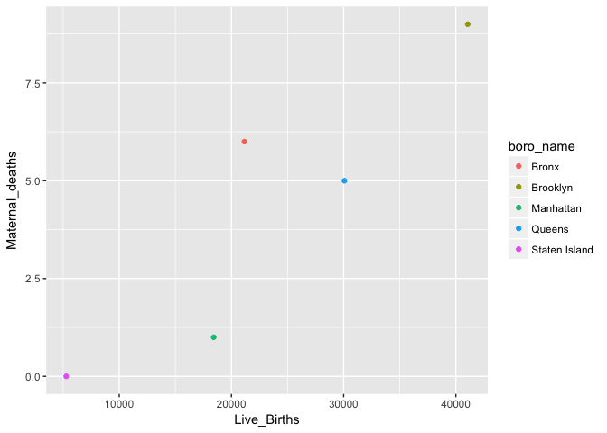

Maternal Mortality in New York
================

R Markdown
----------

This is an R Markdown document. Markdown is a simple formatting syntax for authoring HTML, PDF, and MS Word documents. For more details on using R Markdown see <http://rmarkdown.rstudio.com>.

When you click the **Knit** button a document will be generated that includes both content as well as the output of any embedded R code chunks within the document. You can embed an R code chunk like this:

``` r
library(tidyverse)
```

    ## Loading tidyverse: ggplot2
    ## Loading tidyverse: tibble
    ## Loading tidyverse: tidyr
    ## Loading tidyverse: readr
    ## Loading tidyverse: purrr
    ## Loading tidyverse: dplyr

    ## Conflicts with tidy packages ----------------------------------------------

    ## filter(): dplyr, stats
    ## lag():    dplyr, stats

``` r
library(tidycensus)
library(dplyr)
library(janitor)
library(ggplot2)
library(tmap)
library(tmaptools)
library(sf)
```

    ## Linking to GEOS 3.4.2, GDAL 2.1.2, proj.4 4.9.1

``` r
library(leaflet)
```

Reading in Maternal Mortality Data from
=======================================

``` r
maternal_deaths <- read_csv("/Users/cecilialow-weiner/Desktop/Data Incubator Project /2013_maternal_mortality_rate.csv")
```

    ## Parsed with column specification:
    ## cols(
    ##   boro_name = col_character(),
    ##   Live_Births = col_integer(),
    ##   Maternal_deaths = col_integer()
    ## )

Calculate Maternal Mortality

``` r
maternal_mortality_rate <- maternal_deaths %>%
  group_by(boro_name) %>%
  mutate(rate=(Maternal_deaths/Live_Births)*100000) 
```

Create Basic Scatterplot for Boroughs

``` r
ggplot(data = maternal_mortality_rate) + 
  geom_point(mapping = aes(x = Live_Births, y = Maternal_deaths, color=boro_name))
```



Including Plots
---------------

You can also embed plots, for example:


Note that the `echo = FALSE` parameter was added to the code chunk to prevent printing of the R code that generated the plot.
